# RFC-004-02: LOCK + 决策账（决策导向的对抗性溯因引擎 · 单环整合版）

> **本文是 RFC-004 的整合改写，不是它的续作。** 它把 RFC-004 的全部实质（决策目标、对抗性证据、竞争解释后验、价值导向停止、杀伤链/反取证义务、标定）**完整搬进来**，但换一套表述：
>
> **废弃"内环/外环""叙事信念态"这类说法。** 经第一性原理审计，所谓"外环"在代码上从来不是第二个控制环——三份 RFC 的主循环都是同一个 `while`。真正发生的事是：**在 RFC-003 已造好的那一个 LOCK 循环上，多挂一本"决策账"，并把 O 拍的排序键、K 拍的停止判据升级为决策导向。**
>
> 一句话：**只有一个 LOCK；决策不是一个环，而是一本账。**

---

## 0. 元信息

| 字段               | 内容                                                                 |
| ---------------- | ------------------------------------------------------------------ |
| **状态**           | Draft v2（单环整合 / 决策账表述；含第一性原理审计 7 项承重修正，见 §C）                       |
| **创建日期**         | 2026-06-29                                                         |
| **关键词**          | 单环 LOCK / 决策账 / 竞争解释 + null 锚 / 证据信任 / VOI / 价值导向停止 / 最小核心 vs 可选升级 |
| **与 RFC-003 关系** | **同一个循环的升级**：生成-检验-规划三层 100% 继承，新增第四本账（决策账）+ 升级 O/K 两拍             |
| **取代**           | RFC-004（内容整合至此，原文移入 `备份/`）                                         |

---

## 0.1 前置约定（适用范围）

> ⚠️ **本引擎是溯源（provenance）阶段，被初诊门控在后**——先读懂这一前提，否则下文"良性收敛 / 误报"极易被误读。

本引擎**仅在初诊判恶意 + 重要资产后才启动**一次会话（见 [[初诊 & 溯源]]）。由此两条贯穿全文的约定：

1. **会话级先验 `P(有攻击)` 天然高**。"这整个告警是不是误报"在很大程度上已由初诊回答；故"误报"**不是**主战场，"尽可能把这场攻击溯全"才是正当主目标。
2. **本阶段的确认偏误不表现为"漏判误报"，而表现为"过度归因 / 爆炸半径膨胀"**——把模糊或良性活动织进攻击叙述。因此"良性收敛 / null 锚 / 对称路径"的**主力语义是分支级的**（"这条边不属于本攻击 → 剪枝定界"，对应 [[初诊 & 溯源]] 的关联轴与 PARK/SPAWN），而非会话级的"否掉整个告警"。会话级 `dismiss-benign` 出口保留，但**罕见且重闸门**。

> 一句话：本引擎**不**主张"别假定有攻击"；它主张"溯全时别把不属于这场戏的东西算进来，以及——什么时候算溯够了"。

---

## 1. 摘要 (TL;DR)

RFC-001/002/003 把"**怎么选下一个探针**"打磨到很高水准：单一候选池、图主导硬约束（VETO/MANDATE）、Beta 后验台账、生成器标定。但它们共享一个**未被审视的目标**——把溯源定义为"在预算下把攻击故事拼完整"，并以"探针有没有命中可归因恶意事件"为奖励。

回到第一性原理，**溯源的本质是"在证据可能被对手污染的前提下，以最小代价做出一个带标定置信度、边界清晰且可辩护的处置决策"**——这是一个**决策问题**，"补全"只是其中一部分。因初诊门控（§0.1），"已确认有攻击"通常成立，故补全确是主分支，但补全必须被三件事约束：**不过度归因（边界）、对抗性证据、何时算够（停止）**。

**本文的关键认知（与早期"外环"表述的区别）**：实现以上目标**不需要引入第二个控制环**。所谓"决策大脑"在工程上就是 RFC-003 那个 LOCK 循环里**多挂的一本账**——`决策账`（competing-explanation posterior，含 null 锚）。LOCK 每拍 `L→②检验→O→C→K` 照常跳，只是：

- **K 拍多写一本决策账**（贝叶斯更新，含 null 锚）；
- **O 拍的排序键升级为 VOI**（决策风险削减），让阴性/定界探针也得正分；
- **K 拍后的停止判据升级为价值导向**（决策鲁棒 / maxVOI<成本）；
- **② 检验拍前置一层证据信任**（仅抗伪事实可硬删；缺失/反取证→立义务）；
- **MANDATE 扩三类义务**（生命周期/反取证/判别）。

RFC-003 的三层（单池、graded VETO、MANDATE、Beta 台账、生成器标定、扇出并发）**原封不动**。

> **一句话**：RFC-003 造好了世界级的"探查动作选择器"；本文不另起炉灶、不加第二个环，只给那一个 LOCK 循环**加一本决策账**，把它优化的目标从"把故事拼完"换成"以最小代价做出可辩护的处置"。

---

## 2. 第一性原理：为什么需要一本"决策账"（而不是第二个环）

### 2.1 只有一个循环——"外环"是个误称

最关键的事实：**主循环只有一个 `while`**。RFC-003、RFC-004、本文的伪代码都是单循环，决策账更新、VOI 排序、停止判定**全部发生在同一拍 LOCK 之内**，没有以不同节奏迭代的第二层。早期文档把"决策"画成"套在 LOCK 外面的环"，那是**示意包装**，不是控制结构。真正的双环（belief-lookahead / belief-MCTS）是**非目标**（§11、§12-H）。

> 因此本文不说"外环"。决策不是一个环，而是 LOCK 多挂的一本账 + O/K 两拍的升级。

### 2.2 LOCK 优化的目标是隐式的——不显式化就会过度归因

LOCK 回答**手段**问题（"下一步查什么"），但任何手段优化器都**隐式地**采纳其奖励函数所编码的**目的**。RFC-003 的采集函数奖励"有货"（命中率），它编码的隐式目的就是"**钉到攻击故事上的边越多越好**"——在溯源里这就是**过度归因 / 爆炸半径膨胀**（§0.1）。

> **结论一（条件性不可省）**：只保留命中率排序，不是"没有目标"，而是**默认接受了一个错误的隐式目标**。**在"要让机器自出标定、可辩护、边界清晰的处置"这一目标下**，把目标显式化不可省；若工作负载是无歧义线性链、且可接受把次优/反事实留给人脑，则可退 §11 的 Level-A。这条措辞刻意条件化——遵循 ADR-0002 反对"逻辑必然"overclaim 的同一诚实标准。

### 2.3 交付物里有"探针台账拿不出"的对象

溯源的产物是 **带标定置信的处置 + 攻击边界 + 次优解释 + 反事实**。LOCK 的状态是 `SessionGraph` + per-action Beta 台账（"这类查法历史准不准"）。但"P(攻击)=0.8 且标定良好""次优解释是合法批处理 P=0.15""若 C 内核日志显示登录失败则结论翻转"——**全是关于竞争性整体解释的陈述**。per-probe 命中率台账与"竞争解释后验"是**两个不同的数学对象**，前者推不出后者。

> **结论二（不可省）**：要让机器自出可辩护决策，就必须物化一本**竞争解释后验账**——这是 LOCK 现有三本账拿不出的。这本账就叫**决策账**。

### 2.4 播种决策账不是"凭空编故事"——它是溯因的合法起点

攻击是 A→B→C→D→E（因→果，正向）；溯源从观测到的 E 往回推 E→D→C→B→A（果→因，**反向**）。"由观测结果反推其最可能的若干原因"在逻辑上就叫**溯因（abduction）**，是这件事的本质。开局只有 E 时，播种 `{H1, H2, …, null 锚}` **不声称知道 A–D**，它只是：

- 给"往回查什么"一个**方向**（先验，信息量低、高熵）；
- 给"这条边算不算本案"一个**落点**（null 锚）。

播种决策账 = **给这本账一个廉价的初始值**，与 Beta 台账用 `prior_value` 初始化 `(α0,β0)` 完全同性质。没人会说"Beta 台账初始化是凭空臆想"，因为那只是个会被数据冲刷的先验。决策账亦然。

> **结论三**：决策账的价值在**累积更新**时（每个有歧义的反向步骤），不在播种时。故**播种应当薄**——这也是本文相对早期 RFC-004 的精简方向（§11）。

---

## 3. 设计总览：一个 LOCK 循环 + 四本账

### 3.1 LOCK 四拍（继承 RFC-001 心跳，仅升级 O/K + ②前置信任）

| 拍         | 做什么                                               | 相对 RFC-003 的改动                     |
| --------- | ------------------------------------------------- | ---------------------------------- |
| **L 选哪条** | prior / 规则图诊断 同型投候选 `Probe(target+operator)` 进统一池 | 不变                                 |
| **② 检验**  | VETO 不可能剪枝 + MANDATE 必查义务                         | ⭐前置**证据信任**（仅抗伪可硬删）；MANDATE 扩三类义务  |
| **O 怎么查** | 对幸存候选排序、填满扇出槽                                     | ⭐排序键 = **VOI**（决策风险削减），读决策账        |
| **C 验真**  | 扇出取证 → 入图判假级联（L0–L4），路由 5 桶                       | L3 改为**解释归属**（写 null 锚）            |
| **K 收尾**  | 串行入图 + 学习                                         | ⭐多写**决策账**（含 null 锚）；停止判据改**价值导向** |

### 3.2 四本账（记忆体：被 LOCK 各拍读写）

| 账本                        | 谁写               | 谁读                 | 存什么                                                   | 归属                 |
| ------------------------- | ---------------- | ------------------ | ----------------------------------------------------- | ------------------ |
| **图（SessionGraph）**       | C/K 入图           | 全程                 | 已确认的因果子图                                              | 继承 RFC-003         |
| **Beta 台账 + 标定**          | K（hit/miss）      | O（结果分布估计）          | per-`(operator,target.type,tactic)` Beta；per-source λ | 继承 RFC-003         |
| **义务台账**                  | ②扫描 / K 履行升级     | ②物化预占、停止           | 开放义务 + SLA + 价值×紧迫优先级                                 | 继承 RFC-003（义务类型扩展） |
| **⭐ 决策账（DecisionLedger）** | K（贝叶斯更新含 null 锚） | O（VOI 排序）、停止（决策鲁棒） | 少数(≤4–6)竞争解释的后验 + null 锚                              | **本文新增**           |

> 决策账是**第四本账**，与前三本完全同级。RFC-003 有三本账，本文加第四本——仅此而已，没有"环"。

### 3.3 协同流程图（单环）

> **怎么读**：蓝色 LOCK 主干（L→②VETO→②MANDATE→O→C→K）与 RFC-003 §4.8 一致。本文改动只在 **⭐** 上——K 写**决策账**、O 排序键升级为 **VOI**、② 前置**证据信任**、停止改**价值导向**。把 ⭐ 拿掉即退化回 RFC-003。
> 线型：实线 `-->` = 控制流/探针流；虚线 `-.->` = 账本读写。

```mermaid
flowchart TD
    Start(["告警 E<br/>（初诊判恶意 + 重要资产）"]) --> Boot["分诊 + bootstrap_chain<br/>播种起点·初始因果草图（继承 RFC-003）"]
    Boot --> Seed["⭐ 播种决策账（薄·廉价）<br/>≤4–6 竞争解释 + 1 个分支 null 锚<br/>score_v3 → 初始化先验（高熵·会被冲刷）"]
    Seed --> Loop(["LOCK 每轮循环 ↻"])

    Loop --> L["L 选哪条 · 生成层投候选<br/>prior / 规则图诊断 → 统一池 Probe(target+operator)"]
    L --> Pool["统一候选池 Probe[]<br/>同型 / 去重 / 合并来源"]
    Pool --> Trust["⭐ 证据信任闸门<br/>integrity / 对手可控 / 缺失即信号"]
    Trust --> Veto{"② VETO 不可能剪枝（graded）<br/>不变量 / 容差时序 / 佐证证伪 → 硬删<br/>可达性 → 软负向先验"}
    Veto -- "违反 · 抗伪事实" --> Drop["永久剪枝 + 审计"]
    Veto -- "通过 / 仅对手可控证据" --> Mand["② MANDATE 必查义务<br/>结构 + ⭐生命周期 + ⭐反取证 + ⭐判别<br/>→ 预占槽（价值×紧迫, ≤⌈B/2⌉）"]
    Mand --> O["O 怎么查 · ⭐VOI 排序填余槽<br/>VOI = 期望决策风险削减 − 成本<br/>（阴性/定界探针也得正分）"]
    O --> Gate{"🟡 LLM 闸门<br/>槽不够且候选 VOI 都低？（过 budget+冷却）"}
    Gate -- 是 --> LLM["🟠 LLM 图侦察（贵·gated）→ 投候选 → 再过 VETO/VOI"]
    Gate -- 否 --> Fill["填满剩余槽"]
    LLM --> Fill
    Fill --> C["C 验真 · 扇出取证 → 入图判假级联<br/>L0去噪 / L1结构挂接 / L2信任 / ⭐L3解释归属 / L4 LLM<br/>路由 5 桶(ATTACH/弱挂/PARK/DISCARD/SPAWN)"]
    C --> K["K 收尾 · 串行入图<br/>⭐决策账更新(含null锚) + Beta台账 + 生成器标定<br/>+ 义务履行/逾期升级 + 证据修订级联"]
    K --> Stop{"🟡 ⭐价值导向停止？<br/>maxVOI<EPS / 决策鲁棒 / 硬义务清(结构·反取证) / 预算<br/>（生命周期·判别义务走 VOI 门控）"}
    Stop -- "否 · 下一轮" --> Loop
    Stop -- 是 --> Report(["处置决策 A<br/>contain/escalate · monitor · 分支剪枝定界 · (dismiss-benign 罕见)<br/>+ 标定置信 + 次优解释 + 反事实"])

    Belief[("🟣 决策账<br/>竞争解释后验 + null锚(benign/oos)<br/>+ 边界信念 contested[edge]")]
    TrustLedger[("🟣 证据信任<br/>integrity/对手可控/缺失即信号")]
    K -. "⭐写后验(含null锚)" .-> Belief
    Belief -. "⭐喂 VOI 排序" .-> O
    Belief -. "⭐喂决策鲁棒判定" .-> Stop
    C -. "信任入账" .-> TrustLedger
    TrustLedger -. "⭐收紧硬删权(仅抗伪)" .-> Veto
    TrustLedger -. "⭐缺失/反取证 → 立义务" .-> Mand
    TrustLedger -. "⭐证据修订 → 级联失效 VETO/义务" .-> K

    style Seed fill:#ccffcc,stroke:#2e8b2e,color:#000
    style Boot fill:#ccffcc,stroke:#2e8b2e,color:#000
    style L fill:#cce5ff,stroke:#3366cc,color:#000
    style O fill:#cce5ff,stroke:#3366cc,color:#000
    style C fill:#cce5ff,stroke:#3366cc,color:#000
    style K fill:#cce5ff,stroke:#3366cc,color:#000
    style Pool fill:#eef4ff,stroke:#3366cc,color:#000
    style Trust fill:#e0d6ff,stroke:#9933cc,color:#000
    style Veto fill:#ffd6d6,stroke:#cc4444,color:#000
    style Drop fill:#f0f0f0,stroke:#888,color:#000
    style Mand fill:#ffe0b3,stroke:#e69500,color:#000
    style Gate fill:#fff5cc,stroke:#cc9900,color:#000
    style LLM fill:#ffe0b3,stroke:#e69500,color:#000
    style Fill fill:#eef4ff,stroke:#3366cc,color:#000
    style Stop fill:#fff5cc,stroke:#cc9900,color:#000
    style Report fill:#e6ffe6,stroke:#2e8b2e,color:#000
    style Belief fill:#f0ccff,stroke:#9933cc,color:#000
    style TrustLedger fill:#f0ccff,stroke:#9933cc,color:#000
```



---

## 4. 决策账（DecisionLedger）：竞争解释后验 + null 锚

不再只维护 per-action 的"这条线有没有货"，而是多维护一本**对整体解释的后验**。

```python
@dataclass
class Explanation:           # 一个"整体解释"假设（不再叫"叙事"）
    eid: str
    label: str               # "勒索软件投递阶段" / "合法运维批处理" / ...
    is_null: bool            # null 锚：一等公民（会话级"整个误报"先验低；分支级"这条边不相关"为主力）
    null_kind: str | None    # ⭐ 仅 null 锚有意义："benign"（良性·剪掉即忘）|"oos"（域外真恶意·剪掉并 FEEDBACK/SPAWN）
    lifecycle_stage: str     # 当前推进到的杀伤链阶段
    subgraph: SessionSubgraph
    def likelihood(self, evidence, trust) -> float:
        """P(证据 | 此解释)，按证据信任加权（见 §5；算法见 §6.1）"""

@dataclass
class BoundaryBelief:        # ⭐ 一条有争议边/pivot 的归属（治过度归因的"边粒度"对象，喂边界 VOI，见 §6）
    edge_id: str
    p_in_attack: float       # P(此边属于某攻击解释)
    p_benign: float          # P(良性·域内无关 → 剪掉即忘)
    p_oos: float             # P(域外真恶意 → 剪出本故事 + FEEDBACK/SPAWN，呼应 [[初诊 & 溯源]] 关联轴)
    # 三者归一；边界 VOI 驱动其熵下降，收敛到 in / benign / oos 之一

@dataclass
class DecisionLedger:        # ⭐ 第四本账（取代早期"NarrativeBelief / 叙事信念态"）
    explanations: list[Explanation]      # 含 null 锚；保持小集合（典型 ≤4–6，硬上限 K_max=6）
    log_post: dict[str, float]           # 归一化对数后验 P(H|evidence,trust)
    contested: dict[str, BoundaryBelief] # ⭐ 边粒度归属信念：过度归因发生在"边"上，会话级后验看不见它
    def update(self, evidence, trust): ...     # 贝叶斯更新（含 null 锚 + 更新 contested）
    def entropy(self) -> float: ...            # 决策相关不确定性
    def leading(self) -> Explanation: ...      # MAP 解释
    def margin(self) -> float: ...             # 最优 vs 次优后验间隔
    def spawn_merge_cull(self, evidence, trust, budget): ...   # ⭐ 溯因维护（触发判据见下）
    @classmethod
    def seed(cls, prior) -> "DecisionLedger":
        """用七维 score_v3 初始化各非空解释先验 + 一个 null 锚（默认 benign 型）。薄·廉价·高熵。"""
```

- **null 锚是一等公民，分两个粒度**（呼应 §0.1）：
  - **会话级 null（整个告警是误报）**：因初诊门控，先验**低**；后验上升对应罕见的 `dismiss-benign` 出口（重闸门，见 §7）。是兜底，非主战场。**默认不必常驻一个独立 Explanation**（见 §11 可选项）。
  - **分支级 null 锚（这条边/这个 pivot 不属于本攻击）**：这才是**主力**。每条有争议的候选边都有一个"不属于本攻击"的对称落点，作用是 **(i) 防过度归因/爆炸半径膨胀**——把正常运维、合法账号、与本案无关的真恶意（如另起一桩挖矿）从解释里**剪出去**；**(ii) 给后验一个收敛对象**，让"溯全"能有原则地停（§7）。直接对应 [[初诊 & 溯源]] 入图判假的**关联轴**与 PARK/SPAWN 桶。
  - **⭐ 分支级 null 必须二值（恢复善恶轴×关联轴正交，呼应 [[初诊 & 溯源]]）**："不属于本攻击" ≠ "良性"。`null_kind` 区分两种下游动作完全不同的落点：**`benign`**（域内无关·剪掉即忘）与 **`oos`**（域外真恶意·从本故事剪出 + 走 FEEDBACK/SPAWN 回灌初诊/另起溯源）。把二者合并成一个布尔会**丢失决策相关信息**，也让 SPAWN/回灌这条反向流在决策账里没有承载对象。
  - **⭐ 工程上**：会话级 null 至多一个；分支级归属**不为每条边孵化独立 Explanation**，而是落在 `DecisionLedger.contested[edge_id]` 的三元信念 `{in_attack, benign, oos}` 上——**这才是边界 VOI（§6）能读到、从而能给"定界探针"记正分的对象**。仅当某边被确认为 `oos` 且像真恶意时，才升级为 SPAWN（孵化新解释或回灌初诊）。
- **⭐ 小集合 + 溯因维护（与义务同级的严谨度，防隧道视野）**：解释集合保持小（典型 ≤4–6，硬上限 `K_max=6`）。维护规则**全部有明确触发**，而非"凭感觉"，从而不让它退化成被否决的 HypothesisStack：
  - **孵化（spawn）**：挂到入图判假 **L3 的 SPAWN 桶**（[[初诊 & 溯源]]）——某条**像恶意**的证据在所有现存非空解释下 `max_H P(e|H) < τ_spawn`（"看着是坏事，但没有任何现存故事预期它"）。**反幻觉门**：新解释的种子证据须**抗伪或 ≥2 独立源佐证**（复用 ADR-0001 阈值），否则只 PARK 不孵化。
  - **合并（merge）**：两解释在所有剩余可行探针上的**预测分歧 < τ_merge**（再没有证据能把它们分开）→ 同一个故事，合并。
  - **淘汰（cull）**：解释后验 `< ε_cull` 持续 N 轮，且其生命周期义务已"在此解释下不适用"被消解 → 淘汰。
  - **预算与停机**：到 `K_max` 仍要孵化 → 强制先合并/淘汰腾位；孵化/淘汰均为**有限次**（受 `K_max` + 轮预算上界），故不破坏 §7 可证停机。
  这是 RFC-003 丢掉的"竞争性假设"以**受控**形式回归——**不退回被否决的 HypothesisStack 全量排序**，而是少数竞争解释的后验。
- **prior 的新角色**：RFC-003 的七维 `score_v3` 用来**初始化各非空解释的先验** `P(H)`，而非直接给探针打分。

> 设计自觉（呼应 ADR-0002）：这不是完整 POMDP 的 belief-state。我们刻意把信念限制在**小集合离散解释**上做近似贝叶斯，避免维度爆炸；这是"原则上的 belief-state"与"工程上可算"之间的诚实折中。

---

## 5. 证据信任（EvidenceTrust）：对抗性证据模型

每条进图的事实不再是布尔"真"，而带一个**信任向量**；这是让硬 VETO 立得住的地基。

```python
@dataclass
class EvidenceTrust:
    integrity: float              # 抗伪造程度：内核审计/EDR签名 高；可写日志/墙钟 低
    provenance: str               # 来源链
    adversary_controllable: bool  # 该证据是否处在已确认失陷主机的对手控制面内
    corroboration: int            # 独立来源数
    def is_forge_resistant(self) -> bool:
        return self.integrity >= TAU_HARD and not self.adversary_controllable
```

三条硬约束（强化 ADR-0001 的"只许抗伪事实持删除权"）：

1. **硬 VETO 的前置闸门**：`InvariantVeto` 仍为定义性 0/1；但 `TemporalOrderVeto`/`DisconfirmedVeto` 的"硬"判定**额外要求 `is_forge_resistant()`**。被对手可控证据"证伪/排序"的，最多降为**强负向采集先验**，绝不永久删——根治"用伪造时戳永久杀死真路径"。
2. **缺失即信号（"没叫的狗"）**：主动扫描**应有却没有**的痕迹与**反取证迹象**（日志断层、时间不连续、EDR 静默、`.bash_history` 被清）。这些**生成 MANDATE 义务**（§8），而非当作"此处无事发生"。
3. **似然按信任加权**：§4 的 `likelihood` 对低 integrity / 对手可控证据**降权**，使决策账后验天然对"可能被喂的假线索"保持怀疑——诱饵无法轻易主导后验。

> 这一层补上 RFC-003 最危险的隐患：核心 VETO 层原本立在"证据忠实"的流沙上。现在删除权收紧到抗伪事实，污染证据只能影响**软**层，且**缺失/篡改本身升级为必查义务**。

---

## 6. O 拍：VOI 排序（决策风险削减）

RFC-003 的采集函数奖励"有货"（`exploit=有货后验均值`）。本文把排序键换成**对决策的期望价值**，读决策账：

```python
def voi(p: Probe, ledger: DecisionLedger, beta, calib, loss: LossMatrix) -> float:
    """期望决策风险削减：对探针可能结果做期望，
    每种结果把后验更新到 B'，价值 = 当前Bayes风险 − 期望Bayes风险(B')，再减成本。"""
    risk_now = bayes_risk(ledger, loss)
    exp_risk_after = 0.0
    for outcome, p_outcome in predict_outcomes(p, ledger, beta):   # 见 §6.1：单一生成模型
        B_next = ledger.hypothetical_update(p, outcome)            # 同时更新 explanations 与 contested
        exp_risk_after += p_outcome * bayes_risk(B_next, loss)
    return (risk_now - exp_risk_after) - calib.cost(p)

def bayes_risk(ledger, loss) -> float:
    """⭐ 总风险 = 会话级处置风险 + Σ 边界归属风险。
    缺了边界项，'确认某边不属于本攻击'就削不动风险、VOI≈0——过度归因(边粒度)根治不了。"""
    # (1) 会话级：在会话动作上取最优期望损失（漏掉真攻击 ≫ 其它）
    session = min(sum(ledger.P(H) * loss.session(a, H) for H in ledger.explanations)
                  for a in SESSION_ACTIONS)
    # (2) 边界级：每条有争议边，在 {纳入, 剪枝} 间取最优——
    #     纳入良性/域外边的代价 = LAMBDA_OVER / LAMBDA_OOS（必须 > 0）；把真攻击边剪掉 = LAMBDA_MISS
    boundary = sum(min(b.p_benign * loss.LAMBDA_OVER + b.p_oos * loss.LAMBDA_OOS,   # 纳入此边
                       b.p_in_attack * loss.LAMBDA_MISS)                            # 剪掉此边
                   for b in ledger.contested.values())
    return session + boundary
```

为什么这一步同时治多个病：

- **过度归因被真正定价（A 类承重）**：过度归因发生在**边**上，而会话级后验看不见它。`bayes_risk` 显式加**边界项** + 让误归因代价 `LAMBDA_OVER>0`（而非只罚漏报），"确认某边不属于本攻击"才会**真正削减风险 → 得正分**。⚠️ **单标量 `LAMBDA_MISS` 做不到这件事**：`P(攻击)` 已高时，定界一条边几乎不动会话风险，VOI≈0，定界探针永远排不上（见 §11 对最小核心的修正）。
- **阴性信息有价值**：能**排除某解释**的探针会大幅降低 `session`（哪怕它"扑空"），自然排前 → 治"只奖有货"的确认偏误。
- **判别优先**：在 `margin` 小、解释分歧大处，VOI 自动最高 → 系统主动**消解歧义**，而非盲目补全领先解释。
- **良性收敛被激励**：当证据已足以让 null 主导、且 contested 各边都已收敛，继续探查的 VOI≈0 → 自然停止（§7）。
- **保留 RFC-003 探索项**：`predict_outcomes` 用 Beta 台账 + 生成器标定估计结果分布（含结构新颖度），探索/利用平衡仍由 Thompson 采样承担。VOI 把它们统一进**决策价值**的更高层目标。

> 这是对"完整规划"的**有限深度近似**（默认一步前瞻 VOI）。决策账为前瞻提供干净的 belief 接口：未来可在此做浅层 belief-lookahead，不影响 LOCK 其余拍。

### 6.1 ⭐ 似然与结果预测的一致性契约（决策账的承重接口）

VOI、后验、停止全部从 `Explanation.likelihood` 与 `predict_outcomes` 流出。这两者**必须用同一个生成模型**，否则 VOI 在自相矛盾的模型下算出，决策账会重蹈 RFC-003 已修复的"后验装饰化"覆辙（学习键去 `target.id` 那一课）。明确两条契约：

1. **似然 = 廉价图查询 × 信任加权，只用比值、不标定绝对密度**。对事件 `e` 与解释 `H`（携因果子图 + 当前杀伤链阶段）：

```python
P(e|H) ∝ fit_struct(e, H) · fit_stage(e, H) · w_trust(e)
```

   - `fit_struct`：`e` 能否以**合法边 + 相容时序**挂接到 `H` 子图的 frontier（复用入图判假 **L1**，[[初诊 & 溯源]]）；
   - `fit_stage`：`e` 的战术是否落在 `H` 的 `LifecycleTemplate` 下一步**预期阶段**（§8）；
   - `w_trust`：§5 信任权重（低 integrity / 对手可控 → 降权）。

   三项取对数、各自**有界**（避免连乘过自信）。决策账只消费**解释间的对数似然比**（`log_post` 归一化），从不需要标定绝对概率——这把"算不出真实概率密度"这个老大难绕开。

2. **Beta 台账与解释似然分工、不竞争**（消除 B 类不一致：同证据被两套模型各算一次）。`predict_outcomes` 的结果空间取 `{attributable, benign, oos, no_data}`，预测分布

```python
P(outcome | p) = Σ_H P(H) · P(outcome | H, p)
```

   - **`P(outcome|H,p)` 由上面同一套解释似然给出**（驱动信念移动、决定 `B_next`）；
   - **Beta 台账只供 `P(no_data)` / 探针灵敏度的收缩先验**——"这类查法 `(operator,target.type,tactic)` 历史上**返不返回可归因信号**"，即标定**成本与灵敏度**，**不**另给一套竞争的结局分布。

   于是 **Beta = "这一铲下去挖不挖得到东西"，解释似然 = "挖到了偏向哪个故事"**，二者相乘而非相争。`oos` 是一等结局：它把质量送进 `contested[e].p_oos`，触发 §4 的 SPAWN/FEEDBACK，而非误并入 `benign`。

---

## 7. K 拍后：价值导向停止（与"查什么"同框架）

停止不再是占位的 `converged()`，而是 VOI 框架的另一端：

```python
def should_stop(ledger, beta, budget, obligations, loss) -> StopDecision:
    if budget.exhausted():                        return STOP("budget")        # 无条件硬停
    if obligations.open_hard():                   return CONTINUE              # ⭐ 仅结构/反取证义务无条件续（完整性/对抗）
    # 生命周期/判别义务**不**无条件阻断停止：它们物化为探针，其 VOI 进入 max_voi——
    # 仅当"查清它会改变处置/归因"(VOI≥EPS) 时才会让下面这关续跑（见 §8 义务分级）
    if max_voi(beta, ledger) < EPS_VOI:           return STOP("voi_floor")     # 继续期望收益 < 成本
    if decision_robust(ledger, loss):             return STOP("robust")        # 决策对剩余不确定性鲁棒
    return CONTINUE

def decision_robust(ledger, loss) -> bool:
    """最优处置在后验置信区间扰动下不翻转，且其期望损失 < 可接受阈值。
    统一了'已足够确信是攻击'与'已足够确信是误报'两个出口。"""
```

- **三个出口，对称**：`contain/escalate`（确信攻击且严重）、`dismiss-benign`（确信误报，罕见）、`monitor`（不确定但继续探查 VOI<成本，转低成本观察）。外加**分支级剪枝定界**（主力·高频，confirm-and-prune）。
- **会话级 `dismiss-benign` 罕见且重闸门**：因初诊门控，整案翻误报是小概率，须 `P(会话级 null)` 主导 + 决策鲁棒 + **生命周期/反取证义务全清**三重条件。**真正高频、真正治过度归因的，是分支级剪枝**——靠 §6 的 VOI 让"确认某边不属于本攻击"也得正分。
- **可证停机**：义务锚定离散图实体、按 `(anchor,operator)` 去重、各自 deadline 内履行或升级 → 开放义务受图规模上界；叠加 `maxVOI<EPS` 单调触发 + 预算硬停。对溯源尤其关键——已实现图可近乎无界膨胀（每个 pivot 都"看似可疑"），VOI 停止给"尽可能溯全"一个**决策意义的底**：再查也不改处置/归因结论，即停。
- **⭐ 复合停机（本文新增的证明义务）**：本文比 RFC-003 多了三个"续跑/再生"来源，需重新证停机：(i) **硬义务**（结构/反取证）受图规模上界；(ii) **价值门控义务**（生命周期/判别）不无条件阻断、随 `maxVOI<EPS` 一并塌——否则一个"全套"杀伤链模板会源源不断造生命周期义务、永远 `open()`，从 MANDATE 后门把 VOI 停止架空（即把 hit-rate 完工主义换皮放回）；(iii) **证据修订级联 + 解释孵化**均为**有限次**（孵化受 `K_max` + 轮预算，修订源有限）。三者叠加，停机性在更富的修订源下仍成立。

---

## 8. ② 检验拍：义务扩展（继承 RFC-003 + 三类新义务）

VETO 规则集与 graded 硬度**完全继承 RFC-003 §4.3.1 / ADR-0001**，仅按 §5 收紧"硬"的前置条件（须抗伪造）。

MANDATE 义务**扩展类型**，从"结构缺口"扩到"解释/对抗缺口"：

| 义务类型 | 触发 | 为何必查 |
| -- | -- | -- |
| 结构债务（继承 RFC-003） | 恶意孤儿 / 桥接主机 / 悬空凭据 | 有果无因、有边无机制 |
| ⭐**生命周期债务** | 领先解释的杀伤链模板中**有阶段未被解释**（尤其 objective/impact 未确立） | 结构闭合 ≠ 解释完整：追全横向却没查外泄 = 故事没讲完 |
| ⭐**反取证债务** | §5 检出日志断层/时间不连续/EDR 静默 | "证据被抹"本身是高价值线索，必须主动追 |
| ⭐**判别债务** | 领先解释与次优解释 `margin` 过小，且二者在某探针上预测分歧大 | 主动消解"到底是 H1 还是 H2/null"的关键歧义 |

```python
class LifecycleTemplate:
    """攻击生命周期模板（initial-access→…→impact）。
    对领先解释，列出'按此故事应当存在、但图中尚未确认'的阶段。"""
    def unexplained_stages(self, expl: Explanation, graph) -> list[Stage]: ...

class ObligationLedger:          # 继承 RFC-003 §4.3.2，新增三类扫描器
    def scan(self, graph, ledger, trust, prev_stats) -> list[Obligation]: ...
```

- **义务调度修订**：RFC-003 用 EDF（deadline 主键）。本文改为**价值×紧迫**——主键 `VOI(obligation)/time_to_deadline`，避免"近 deadline 的低价值义务压过关键义务"。上限 `⌈B/2⌉`、逾期升级、持续溢出整批升人工等保护**全部继承**。详见 [[docs/adr/0003-value-urgency-obligation-scheduling]]。
- **⭐ 义务对"停止"的作用分级（治 MANDATE 后门完工主义）**：开放义务分两类，决定它们对 §7 停止的约束力——
  - **硬阻断**（结构债务、反取证债务）：关乎完整性闭合与对抗，未清 **无条件**续跑（`obligations.open_hard()`）。
  - **价值门控**（生命周期债务、判别债务）：物化为探针后其 VOI 进入 `max_voi`，**仅当 VOI≥EPS 才阻断停止**。

  否则一个"全套"杀伤链模板会源源不断造生命周期义务、永远 `open()`，把 §7 的 VOI 停止架空——等于从 MANDATE 后门把 hit-rate 完工主义放回来。"objective/impact 必须查清"因此被精确化为"**当且仅当查清它可能改变处置/归因结论时**必须查清"。
- **义务"履行"对齐解释**：`discharged_by` 既可被算子覆盖关闭，也可因"该阶段被证明在此解释下不适用"而关闭——后者会**反向更新决策账**（某阶段证不出来 → 降低该解释概率，可能抬升 null）。

---

## 9. K 拍：学习层（完全继承 RFC-003 + 决策校准）

- **Beta 后验台账**、**learning-key/dedup-key 分离**、**生成器标定（per-source Beta + ε-floor）**、**多源佐证 bonus**：**全部继承** CONTEXT.md / RFC-003 定稿，不重述。
- **新增：决策校准**。在 §6 的 `predict_outcomes` 上记录"预测的结果分布 vs 实际结果"，做**可靠性校准**（reliability diagram / isotonic），保证 VOI 估计与最终决策置信度**标定良好**——支撑"说 80% 把握时真有 80%"。

---

## 10. 主循环骨架（单环伪代码）

> 注意：**只有一个 `while`**。决策账只是 `self.ledgers` 里多出来的一本；没有"外环"包裹。

```python
class DecisionOrchestrator(Orchestrator):   # 继承 RFC-003 的 Orchestrator
    def run(self):
        self.triage_entry(); self.bootstrap_chain()
        self.beta    = BetaLedger(); self.calib = GenCalibration()
        self.obligations = ObligationLedger()
        self.trust   = EvidenceTrustModel()
        self.ledger  = DecisionLedger.seed(self.prior)    # ⭐ 第四本账：薄·廉价·高熵
        prev_stats = self.session_graph.stats()

        while True:                                       # ← 唯一的循环
            self.round += 1; g = self.session_graph

            # L 选哪条（生成层，继承 RFC-003）
            pool  = prior_generator(g, self.ledger, self.prior)   # prior 现服务于解释先验
            pool += rule_gap_generator(g, prev_stats)

            # ② 检验（继承 RFC-003 + 证据信任收紧 + 三类新义务）
            self.obligations.cascade_on_revision(self.trust.revisions())
            self.obligations.scan_and_merge(g, self.ledger, self.trust, prev_stats)
            self.obligations.discharge(g, self.ledger)
            pool, rejected = veto_filter(pool, g, self.trust)     # 仅抗伪事实可硬删
            mandated = self.obligations.materialize_open(g, veto_filter)

            # O 怎么查（排序键 = VOI，读决策账）
            slots  = self.fanout_budget
            chosen = self._reserve_by_value(mandated, cap=ceil(slots/2))   # 价值×紧迫
            if len(chosen) < slots:
                key = lambda p: -voi(p, self.ledger, self.beta, self.calib, LOSS)
                ranked = sorted(pool, key=key)
                if should_call_llm_scout(ranked, self.ledger, self.budget, self):
                    extra, _ = veto_filter(llm_gap_generator(g, self._scout_focal(self.ledger)), g, self.trust)
                    ranked = sorted(pool + extra, key=key); self.last_llm = self.round
                chosen += self._fill(ranked, slots - len(chosen))

            # C 验真（扇出并发取证，入图判假级联；继承 RFC-001 §4.8）
            events  = self.pruning.apply_rules(self.pivot_agent.execute_fanout(chosen))
            triaged = self.llm.triage({"events": events})         # 返回 confirmed + 信任标注
            self.trust.ingest(triaged)                            # 证据信任入账

            # K 收尾（学习 + 决策账更新 + 校准）
            self.session_graph.add_events(triaged["confirmed_events"])
            self.ledger.update(triaged, self.trust)               # ⭐ 含 null 锚的贝叶斯更新
            for p in chosen:
                hit = count_attributable(triaged, p) > 0
                self.beta.update(p.learning_key(), success=int(hit), fail=int(not hit))
                self.calib.record(p.source, hit)
            self.calib.record_decision_outcome(...)               # ⭐ 校准
            self.obligations.discharge(g, self.ledger)
            self._escalate(self.obligations.overdue(self.round))
            prev_stats = g.stats()

            stop = should_stop(self.ledger, self.beta, self.budget, self.obligations, LOSS)
            if stop: break

        return self.narrate_agent.narrate(self.ledger, stop_reason=stop)  # 带置信+次优+反事实
```

---

## 11. 最小核心 vs 可选升级（避免过度设计）

决策账的价值**∝ 案件的歧义量，而非链条长度**（§2.4）。据此把本文机制分成**不可省的承重墙**与**可插拔的升级**，按需启用，避免一上来全套：

### 11.1 承重墙（最小核心，建议 0-1 期必做）

| 核心 | 最小实现 | 为何不可省 |
| -- | -- | -- |
| **显式决策目标** | 会话动作 `{monitor, contain/escalate, dismiss-session}` + 边界动作 `{纳入, 剪枝}` + **两标量 `LAMBDA_MISS ≫ LAMBDA_OVER > 0`**（漏报最贵，但误归因代价**必须非零**） | **单标量只罚漏报 → 定界 VOI≈0 → 治不了过度归因**（§6/§2.2）；两标量是治过度归因的真正下限 |
| **决策账（薄版）** | ≤4 竞争解释 + 1 个分支 null 锚（二值 `benign`/`oos`）+ `contested[edge]` 边界信念；似然用廉价图查询近似（§6.1） | 交付物（标定置信/次优/反事实/边界）唯一能读出的对象；边界信念是定界 VOI 的载体（§2.3/§6） |
| **O 决策项** | RFC-003 采集函数 **加一个边界决策项**（不必完整 VOI 前瞻），让阴性/定界**真**得正分——决策项必须读 `contested` 边界风险，否则只压会话级 margin 仍治不了边粒度过度归因 | 治过度归因的最小机制（§2.2/§6） |
| **价值导向停止** | `决策鲁棒 / maxVOI<EPS / **硬**义务清(结构·反取证) / 预算`（生命周期/判别义务走 VOI 门控，§8） | 给"溯全"一个可证停止的底，且不被完工主义义务架空（§7） |

### 11.2 可选升级（有明确收益再启用，接口已预留）

| 升级项 | 替换/扩展的核心 | 何时值得 |
| -- | -- | -- |
| **完整一步 VOI + 损失矩阵** | 边界决策项 → 完整 `voi()`（会话+边界双项）；两标量 `LAMBDA_MISS/LAMBDA_OVER` → `|H|×|A|` 矩阵 | 需要精细权衡多动作多解释时 |
| **对抗性似然加权** | 信任层只保留 ADR-0001 硬删收紧 → 加 §5.3 似然降权 | 对手投毒/诱饵是真实威胁时 |
| **生命周期 / 反取证义务** | MANDATE 只用结构债 → 加模板/扫描器（§8） | APT、需确立 objective/impact 时 |
| **会话级 null 常驻 + dismiss 出口** | 默认不常驻 → 常驻一个 Explanation | 误报率不可忽略、需机器自动 dismiss 时 |
| **决策校准曲线 / 对抗红队评测** | 降级为目标 → 接入训练/评测 | 要对外声明标定置信度时 |

> **Level-A 极简退路**：若真实工作负载以**无歧义线性链**为主（每步证据近确定性点出下一 pivot、罕有良性边混入），可连决策账都不维护，只在 O 加"阴性/定界正分" + C 的 PARK/null 路由。代价：放弃机器自出标定决策（次优/反事实回到人脑）。这是"价值∝歧义量"的逻辑终点。

---

## 12. 关键设计决策

### 12.1 决策 A：为什么要一本"决策账"而非只优化探针？
溯源的产物是**处置 + 置信度 + 边界**，三者只能从"对竞争解释的后验"读出。把一等优化对象放在探针上，只能优化局部产出率，无法回答"是不是攻击、有多确信"。RFC-003 的探针池作为**实现这本账更新的手段**保留。

### 12.2 决策 B：为什么 null 锚必须是一等公民？
溯源的确认偏误**不是**"漏判误报"（被初诊门控，会话级误报先验低），而是**过度归因**——没有 null 锚，系统被"有货才有奖励"驱动，把模糊/良性/不相关活动越织越多（爆炸半径膨胀）。null 锚提供对称落点，主力是**分支级**"这条边不属于本攻击 → 剪枝定界"；会话级"否掉整案"只是罕见兜底。

### 12.3 决策 C：为什么用 VOI（决策风险削减）而非命中率排序？
命中率把"往故事上钉边"奖得高、"确认某边不属于本攻击"奖得低（记成 miss），与溯源的对称目标相悖，且系统性低估**信息量大的阴性/定界探针**，直接喂大过度归因。VOI 用"对决策的期望价值"统一二者，并让**判别性探针**自动浮前；它还把"查什么"和"何时停"收口为同一框架。

### 12.4 决策 D：为什么把证据信任做成一层？
对手能动性是溯源的**第一性特征**。把"证据可被污染"上升为贯穿似然计算、VETO 删除权、义务生成的一层，才能系统性地 (a) 防止污染证据杀真路径；(b) 把"证据被抹"变成线索而非空白。零散打补丁补不全。

### 12.5 决策 E：为什么完整性按杀伤链模板而非图拓扑？
图结构闭合（无悬空边）不等于故事讲完（不知攻击目的与影响）。把完整性锚在生命周期模板上，"未确立 objective/impact"才会成为最高义务——这往往是 IR 中最关键、却最易被"结构已闭合"假象掩盖的缺口。

### 12.6 决策 F：为什么停止是 VOI 的另一端？
预算约束下，"还要不要查"与"查什么"是同一个最优停止问题的两面：`max VOI < 成本` 或决策鲁棒就停。把停止做成独立阈值（如熵/EWMA）会与排序解耦——用同一个 VOI 度量消除解耦。

### 12.7 决策 G：为什么义务调度从 EDF 改价值×紧迫？
纯 EDF 会让临近 deadline 的低价值义务压过关键义务。改 `VOI/time_to_deadline` 让重要且紧迫者先行，severity 仅在 VOI 不可估时回退。上限与升级保护不变。

### 12.8 决策 H：诚实的近似边界（呼应 ADR-0002）
**不**声称完整 POMDP 最优。三处刻意近似：(1) 信念限制在小集合离散解释；(2) VOI 默认一步前瞻；(3) 损失需人工设非对称代价。三处都留升级接口，0-1 期用够用近似。

### 12.9 ⭐ 决策 I：为什么是"一本账"而不是"第二个环"？
代码上只有一个 `while`（§2.1），决策更新/排序/停止全在同一拍内完成，没有以不同节奏迭代的第二层。把它叫"外环"会误导读者去找一个并不存在的控制结构，也让"播种"显得像凭空生成剧情。改称"第四本账 + O/K 两拍升级"后：(a) 与图/Beta/义务三账同构，认知负担最小；(b) "播种"= 给账初始化先验，与 Beta 台账初始化同性质，不再玄乎；(c) 升级路径清晰——要更强就把账的更新/前瞻做深，而非新增一层循环。真正的多环（belief-lookahead）留作可插拔升级（§11）。

---

## 13. 与 RFC-003 的关系与继承

| 维度 | RFC-003 | **本文（RFC-004-02）** |
| -- | -- | -- |
| 控制结构 | 一个 LOCK 循环 | **同一个 LOCK 循环**（不加环） |
| 账本数 | 三本（图 / Beta / 义务） | **四本**（+ 决策账） |
| 一等优化对象 | Probe(候选池) | Probe **+ 决策账（竞争解释含 null 锚）** |
| 目标函数 | 命中率（加性采集） | **贝叶斯决策风险削减（VOI）** |
| 良性/误报路径 | 无 | **null 锚一等 + 价值导向出口** |
| 证据假设 | 忠实（开放世界仅可达性） | **信任层：对手可控/反取证/缺失即信号** |
| VETO 删除权 | 抗伪封闭世界（ADR-0001） | **进一步要求 `is_forge_resistant`** |
| 完整性 | 结构义务（硬·SLA） | **+ 生命周期/反取证/判别义务** |
| 义务调度 | EDF | **价值×紧迫** |
| 停止 | `converged()` 占位 | **VOI 另一端（统一框架·可证停机）** |
| 输出 | 报告 | **决策 + 标定置信 + 次优 + 反事实** |

**完整继承（不重造）**：单一候选池与 Probe 去重、graded VETO 与证据修订级联（ADR-0001）、MANDATE 的 SLA/⌈B/2⌉ 上限/升级骨架、Beta 台账与 learning-key/dedup-key 分离、生成器标定（per-source Beta + ε-floor）、多源佐证 bonus、cascade 触发、取证扇出并发（RFC-001 §4.8）、七维 score_v3（现用于初始化解释先验）。

> 一句话：**本文 = RFC-003 的那一个 LOCK 循环 + 一本决策账 + O/K 两拍升级。** 内层越好，这本账越省力——前三版的所有打磨都没浪费，只是被放到了正确的层级。

---

## 14. 风险与缓解

| 风险 | 概率 | 影响 | 缓解 |
| -- | -- | -- | -- |
| 决策账维护变贵（似然/解释孵化） | 中 | 中 | 解释集合限小(≤4–6)；似然用廉价图查询近似；贵的 LLM 评估按需 gated；薄播种（§2.4） |
| 损失需人工设定、易拍错 | 中 | 高 | 0-1 期用**单标量 `LAMBDA_MISS`**（漏报代价高）保守默认；敏感性分析；预留"从历史误报/漏报学损失"接口 |
| **会话级 null** 设太强 → 过早否掉真攻击 | 低 | 高 | 决策鲁棒须置信区间扰动下不翻转；生命周期/反取证义务未清不得走 dismiss；`LAMBDA_MISS≫1` 结构性偏保守；默认不常驻会话级 null（§11） |
| **分支级 null 锚设太弱 → 过度归因** | 中 | 中 | VOI/决策项给"确认某边不属于本攻击"正分；PARK/SPAWN 把不相关真恶意另起一案；边界写进报告供人工复核 |
| 证据信任打分被对手操纵 | 低 | 高 | integrity 锚在抗伪遥测（内核审计/EDR 签名）；对手可控面保守判定；信任规则视为安全敏感不外发 |
| VOI 计算复杂、估计噪声大 | 中 | 中 | 一步前瞻；用 Beta 台账+标定给结果分布；冷启动回退 RFC-003 加性采集，或退 §11 决策项 |
| 误把决策账当"第二个环"过度工程化 | 中 | 中 | 本文明确单环表述（§2.1/§12.9）；决策账与三账同构；多环（lookahead）仅作可插拔升级 |
| 范围过大、0-1 难落地 | 高 | 中 | §11 最小核心 vs 可选升级；§15 分相落地 |

---

## 15. 实施相位（务实灰度）

### Phase 0：LOCK 三层就位（= 落地 RFC-003）
单池 + graded VETO + MANDATE + Beta 台账 + 标定。**通过标准**：复现 RFC-003 全部 SLO。

### Phase 1：决策账（薄版）+ 显式目标
`DecisionLedger`（≤4 解释 + 1 null 锚）+ `seed` + 廉价似然更新；动作集 + 单标量 `LAMBDA_MISS`；`dismiss-benign` 出口。**通过标准**：能从终态账读出标定置信 + 次优解释；"高可疑实为良性"的边被归入 null 锚，无确认偏误式空转。

### Phase 2：决策项排序 + 价值导向停止
O 排序加决策项（先 margin 代理，可升级完整 VOI）；`should_stop` 用 maxAcq/VOI + 决策鲁棒；义务调度改价值×紧迫。**通过标准**："关键阴性可定界"case 中定界探针被优先；停止轮数 ≤ RFC-003 且决策正确率不降。

### Phase 3：证据信任层 + 杀伤链/反取证义务
`EvidenceTrust` 入账；VETO 删除权收紧到抗伪事实；缺失/反取证/生命周期/判别义务。**通过标准**："时戳伪造诱导误剪"红队 case 不再永久误删；"日志被抹"case 生成反取证义务。

### Phase 4：标定 + 对抗评测 + 升默认
决策校准（reliability diagram）；对抗红队 + 对标人类 + 结果级指标。`hybrid_v4`→`decision_v5` 升默认，旧路径留基线。

---

## 16. 验收指标 (SLO)

- ✅ **可读决策**：终态可输出 标定置信 + 次优解释 + 反事实 + 攻击边界（LOCK 三账单独拿不出）。
- ✅ **治过度归因**：相对纯 RFC-003，"良性/不相关边被织入攻击叙述"数量显著下降；定界探针得正分被优先。
- ✅ **不放过真攻击**：`LAMBDA_MISS≫1` 下，会话级 `dismiss-benign` 仅在 null 主导 + 决策鲁棒 + 生命周期/反取证义务全清三重条件触发。
- ✅ **对抗鲁棒**："时戳伪造/日志抹除"红队 case：0 因污染证据导致真路径永久误删；反取证痕迹 100% 立义务。
- ✅ **判别效率**："H1 vs H2 歧义"case：判别性探针被优先，达成定性轮数 ↓ ≥30%。
- ✅ **可证停机**：义务受图规模上界 + maxVOI<EPS 单调触发 + 预算硬停。
- 🟡 **置信标定（标签门控）**：**已接入足量结果标签**（IR 收口真值，来自 [[初诊 & 溯源]] 反向流⑤，样本量 ≥ `N_calib`）时，最终决策置信度 ECE ≤ 0.1（说 80% 真约 80%）；0-1 期标签不足时降为**方向性目标 + 相对可靠性比较**，不作硬验收——与 §11"决策校准属可选升级"保持一致（修复早期把它当硬 SLO 与 §11 打架）。
- ✅ **复杂度可控**：最小核心新增承重仅 决策账(薄) + O 决策项 + 停止判据；无新增循环、无强制手调矩阵、无强制信任扫描器（§11）。

---

## 17. FAQ

**Q1：这是不是推翻了 RFC-003？**
> 不是。RFC-003 的三层、三本账原封不动。本文只加第四本账（决策账）+ 升级 O/K 两拍 + ② 前置信任。前三版打磨没浪费。

**Q2：为什么不叫"外环"了？**
> 因为代码上根本没有第二个环——只有一个 `while`（§2.1/§12.9）。"外环"会让人去找一个不存在的控制结构，也让"播种"显得像凭空生成剧情。改称"决策账"后与图/Beta/义务三账同构，认知最简。

**Q3：只拿到告警 E 就"播种"，是不是凭空臆想？**
> 不是。溯源是果→因的**溯因**，"反推 E 的若干可能原因"是任务本质（§2.4）。播种放进去的是**廉价高熵的先验 + 一个 null 落点**，不是完整剧情；它只给反向搜索一个方向，会被后续证据冲刷。决策账的价值在**累积更新**时，不在播种时——故播种应当薄。

**Q4：恢复"竞争性解释"，不是回到被否决的 HypothesisStack 全量排序吗？**
> 不是。HypothesisStack 把**每个假设**当被排序的一等对象（RFC-003 正确否了它）。这里是把**少数(≤4–6)整体解释的后验**当一本账，探针仍在统一池里、仍按 VOI 排序。是"少数解释的信念"，不是"海量假设的队列"。

**Q5：会不会让 Agent 太容易放过真攻击？**
> 不会。走会话级 `dismiss-benign` 需三重闸门：null 主导、决策置信区间扰动下鲁棒、生命周期/反取证义务全清。`LAMBDA_MISS≫1` 对漏报设高代价，结构上偏保守。

**Q6：VOI 计算会不会太贵？**
> 默认一步前瞻，结果分布复用 Beta 台账与标定（廉价），只对少数竞争解释算期望风险。冷启动/预算紧张回退 RFC-003 加性采集，或退到 §11 的 margin 决策项。精度/成本可调。

**Q7：会不会过度设计？**
> 把决策账做重（完整 VOI 矩阵、会话级 null 常驻、生命周期模板全套）在开局确实是过度设计。本文用 §11 把这些降为**可选升级**，承重墙只剩薄决策账 + 决策项 + 决策停止；无歧义线性链负载甚至可退 Level-A。价值∝歧义量。

---

## 18. 附录

### A. 术语对照（含改名映射）
| 术语 | 含义 | 早期叫法（已废弃） |
| -- | -- | -- |
| **决策账 (DecisionLedger)** | 对少数竞争解释（含 null 锚）的后验，LOCK 的第四本账 | ~~叙事信念态 / NarrativeBelief / 叙事后验~~ |
| **LOCK（单环）** | 唯一的控制循环 `L→②检验→O→C→K` | ~~内环 / 执行内环~~ |
| **O/K 两拍升级 + 决策账** | 决策能力的落点 | ~~决策外环~~ |
| **解释归属** | 入图判假 L3：某证据归到哪个解释或 null 锚 | ~~叙事归属~~ |
| **解释完整 / 杀伤链完整** | 生命周期模板度量的完整性 | ~~叙事完整~~ |
| null 锚（双粒度 + 二值） | 会话级=整案误报（罕见兜底）；分支级=这条边不属于本攻击（主力·防过度归因），再分 `benign`(良性·剪掉即忘) / `oos`(域外真恶意·FEEDBACK/SPAWN) | — |
| 边界信念 (BoundaryBelief) | 每条有争议边/pivot 的三元归属 `{in_attack, benign, oos}`；过度归因是**边粒度**的，会话级后验看不见，故需独立载体喂边界 VOI | — |
| 边界风险 / 误归因代价 | `bayes_risk` 的边界项：纳入良性/域外边的代价 `LAMBDA_OVER`/`LAMBDA_OOS`（**必须 > 0**）vs 剪掉真攻击边的代价 `LAMBDA_MISS`；非零 `LAMBDA_OVER` 是"定界得正分"的前提 | — |
| 溯因维护 | 决策账解释集合的孵化(挂 L3 SPAWN)/合并/淘汰，全部带明确触发 + `K_max` 预算，防隧道视野又保停机 | — |
| 过度归因 / 爆炸半径膨胀 | 溯源版确认偏误；对称解药是分支级剪枝定界 | — |
| 证据信任 (Evidence Trust) | 每条事实的 integrity/provenance/对手可控性；硬删只给抗伪事实 | — |
| 决策风险 (Bayes risk) | 对竞争解释取期望、按非对称损失计的最优动作期望损失 | — |
| 信息价值 (VOI) | 探针/义务价值 = 期望决策风险削减 − 成本；统一"查什么"与"何时停" | — |

### B. 一句话主张
> **溯源 = 一个 LOCK 循环 + 四本账。** 前三本（图 / Beta / 义务）由 RFC-003 造好，把"下一步查什么"解到接近最优；本文加第四本**决策账**（竞争解释后验 + null 锚），把 O 拍排序键升级为 VOI、K 拍停止升级为价值导向、② 前置证据信任——于是这台机器的目标从"把故事拼完"升级为"**在证据可能被对手污染的前提下，以最小代价做出边界清晰、可辩护、带标定置信度的处置**"。**决策不是一个环，而是一本账。**

### C. 变更历史
| 日期         | 版本                  | 变更                                                                                                                                                                                                                                                                                                                                                                                                                                                                           |
| ---------- | ------------------- | ---------------------------------------------------------------------------------------------------------------------------------------------------------------------------------------------------------------------------------------------------------------------------------------------------------------------------------------------------------------------------------------------------------------------------------------------------------------------------- |
| 2026-06-27 | RFC-004 Draft v1/v2 | （原 RFC-004，已移入 `备份/`）叙事后验 + 证据信任 + VOI + 价值停止 + 三类义务 + 标定                                                                                                                                                                                                                                                                                                                                                                                                                    |
| 2026-06-29 | RFC-004-02 Draft v1 | **单环整合改写**：废弃"内环/外环""叙事信念态"表述，统一为"一个 LOCK 循环 + 决策账（第四本账）"；新增 §2 第一性原理（只有一个环 / 播种是溯因不是臆想）、§11 最小核心 vs 可选升级、§12.9 为何是账非环；完整集成 RFC-004 的证据信任/VOI/义务/停止/标定，原文移入备份                                                                                                                                                                                                                                                                                                                |
| 2026-06-29 | RFC-004-02 Draft v2 | **第一性原理审计收口（7 项承重修正）**：(A) `bayes_risk` 加**边界项** + 两标量 `LAMBDA_MISS/LAMBDA_OVER`，让边粒度定界真得正分（§6/§11）；(E) 分支级 null 锚**二值化** `benign`/`oos`，恢复善恶轴×关联轴并接 SPAWN/FEEDBACK（§4）；(B) 新增 §6.1 似然与 `predict_outcomes` **一致性契约**（Beta 标定灵敏度 × 解释似然驱动信念，不竞争）；(C) §4 **溯因维护**孵化/合并/淘汰触发判据（挂 L3 SPAWN + `K_max` 预算）；(D) §7/§8 义务对停止**分级**（硬义务无条件续，生命周期/判别走 VOI 门控）+ 复合停机证明；(G) §16 ECE 标签门控化；(H) §2.2 overclaim 条件化。新增 [[docs/adr/0003-value-urgency-obligation-scheduling]]；同步 [[CONTEXT]] |
